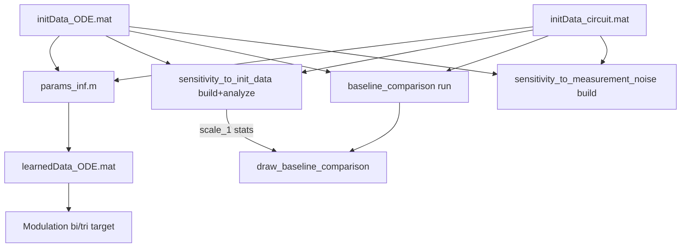

# RLT circuit workflow

Electronic repressilator-like circuit (RLT): FMAM parameter inference from hardware data, baseline optimizer comparison, sensitivity analyses, and orthogonal period modulation (Fig. 4; Extended Data Fig. 3; Extended Data Fig. 5). Global map: [FIGURE_WORKFLOW_MAP.md](../FIGURE_WORKFLOW_MAP.md).

## Model and shared data

| Path | Role | Produced by |
|---|---|---|
| `System.m`, `circuit_forward_orbit.m` | ODE definition and forward periodic-orbit extraction | — |
| `parameter_inference/initData_ODE.mat` | ODE baseline parameters + orbit (FMAM initial guess) | archived / external |
| `parameter_inference/initData_circuit.mat` | Measured circuit time series + targets | archived / external |
| `learnedData_ODE.mat` | FMAM-inferred parameters + ODE orbit | `parameter_inference/params_inf.m` |

Most scripts expect repo root on the path: `addpath(genpath(pwd))`.

## Sub-workflows

| Folder | Purpose | Workflow |
|---|---|---|
| `parameter_inference/` | Core inference + Fig. 4 main panels | this file (core scripts below) |
| `parameter_inference/baseline_comparison/` | Black-box vs proposed method | [baseline_comparison/WORKFLOW.md](parameter_inference/baseline_comparison/WORKFLOW.md) |
| `parameter_inference/sensitivity_to_init_data/` | Random-init + scale sweep | [sensitivity_to_init_data/WORKFLOW.md](parameter_inference/sensitivity_to_init_data/WORKFLOW.md) |
| `parameter_inference/sensitivity_to_measurement_noise/` | Noisy measurement sweep | [sensitivity_to_measurement_noise/WORKFLOW.md](parameter_inference/sensitivity_to_measurement_noise/WORKFLOW.md) |
| `Modulation_bi_target/` | Period modulation, one amplitude fixed | [Modulation_bi_target/WORKFLOW.md](Modulation_bi_target/WORKFLOW.md) |
| `Modulation_tri_target/` | Period modulation, two amplitudes fixed | [Modulation_tri_target/WORKFLOW.md](Modulation_tri_target/WORKFLOW.md) |

Legacy/exploratory scripts at this level (`Modulation_phase.m`, `Modulation_observable.m`) are not wired into the figure map.

## Recommended global run order

**Plot-only (archived `.mat` data):** run draw scripts in each sub-workflow (see linked WORKFLOW files).

**Full rebuild:**

1. **Shared inputs** — ensure `initData_ODE.mat` and `initData_circuit.mat` exist under `parameter_inference/`.
2. **Core inference** — `parameter_inference/params_inf` → `learnedData_ODE.mat` (feeds modulation folders and several draw scripts).
3. **Modulation (parallel OK)** — [Modulation_bi_target](Modulation_bi_target/WORKFLOW.md) and [Modulation_tri_target](Modulation_tri_target/WORKFLOW.md) after step 2.
4. **Initial-data sensitivity** — `build_init_data_files` → `build_sensitivity_to_init_data` → `analyze_sensitivity_to_init_data` ([details](parameter_inference/sensitivity_to_init_data/WORKFLOW.md)).
5. **Baseline comparison** — `baseline_comparison/params_inf` → `run_baseline_comparison` ([details](parameter_inference/baseline_comparison/WORKFLOW.md)).
6. **Measurement-noise sensitivity (parallel with 4–5)** — `build_noisy_init_data_files` → `build_modulation_results` ([details](parameter_inference/sensitivity_to_measurement_noise/WORKFLOW.md)).
7. **Plotting** — run draw scripts; for Fig. 4 baseline panels, **`draw_baseline_comparison` requires sensitivity results at scale = 1** from step 4.

## Core parameter_inference scripts

| Script | Purpose | Output / figure |
|---|---|---|
| `params_inf.m` | FMAM fit circuit targets; save inferred ODE orbit | `../learnedData_ODE.mat`, `params_modulation_path.mat` |
| `draw_TS.m` | ODE vs circuit time series (`cls`: `learned` or `init`) | interactive figure → Fig. 4 |
| `draw_params.m` | Parameter continuation path in \((R_C,C_1,C_2,C_3)\) space | interactive figure → Fig. 4 |
| `loss_function.m` | Shared orbit/property loss (used by baselines and analyses) | — |

## Figure reproduction

| Figure | Location | Key scripts |
|---|---|---|
| Fig. 4 (inference TS + parameter path) | `parameter_inference/` | `draw_TS`, `draw_params` |
| Fig. 4 (baseline comparison) | `baseline_comparison/` | `draw_baseline_comparison` (+ sensitivity scale 1) |
| Fig. 4 (init-data sensitivity) | `sensitivity_to_init_data/` | `draw_sensitivity_to_init_data_violin`, `draw_sensitivity_to_init_data_success_rate` |
| Fig. 4 (measurement noise) | `sensitivity_to_measurement_noise/` | `draw_sensitivity_to_measurement_noise` |
| Extended Data Fig. 3 | `Modulation_bi_target/`, `Modulation_tri_target/` | `draw_params`, `draw_TS` |
| Extended Data Fig. 5 | `sensitivity_to_init_data/` | `draw_sensitivity_to_init_data` |

Seeds and toolbox versions: [ENVIRONMENT_AND_SEEDS.md](../ENVIRONMENT_AND_SEEDS.md).
